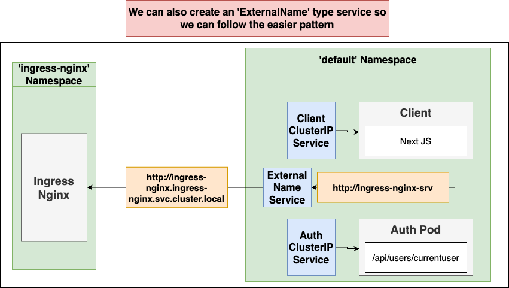
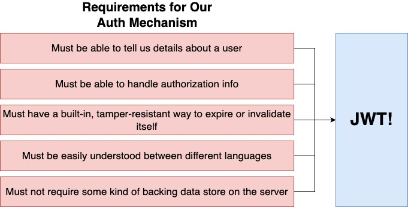
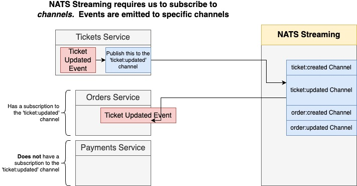
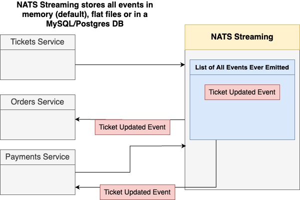
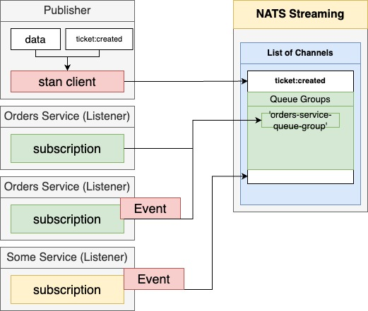

# ticketing-microservices

[Course](https://www.udemy.com/course/microservices-with-node-js-and-react)

Creating a microservices based application for ticketing using the MERN tech stack. The infrastructure is managed with `k8s` and related technologies.

## Concepts to reference in the future

### Kubernetes

- Kubernetes config (ClusterIP services, ingress controllers, NodePort for debug, load balancer service) and `skaffold` for local dev
- Creating secrets with `kubectl` and mapping to env variables in pods
- `kubernetes` namespaces: how to reach back to the ingress-nginx-controller from a pod (`nextjs` server in this case)



- A few helpful commands:

```bash
kubectl get services
kubectl get namespace
kubectl get services -n ingress-nginx
```

### Node backend

- Mongoose ORM usage (statics, pre save hooks etc)
- Password hashing in NodeJS
- Making TS and Mongoose play nice
- `toJSON` method in `mongoose`
- Setting cookies in `express`
- Extending `express` types:

```ts
declare global {
  namespace Express {
    interface Request {
      currentUser?: UserPayload;
    }
  }
}
```

- Jest setup config in `package.json`, ie: setting up `env` vars
- User `supertest` and `mongo-memory-server` for integration tests

### Authentication

- JWT vs Cookies



### NextJS

- [Importing global css](./client/pages/_app.js)
- `getInitialProps` gets executed on the client side iff next app redirects from a page! Otherwise it is executed on the server, [see example](https://github.com/mtanzim/ticketing-microservices/blob/2920efa4fdcee790d6145bab36f76281fe37a58a/client/pages/index.js#L12)

### NPM Modules

- Creating NPM orgs, publishing and patching modules
- Setting up JS transpilation for TS modules

### NATS Streaming Server

- [Documentation](https://github.com/nats-io/nats-streaming-server#nats-streaming-server)
- To port forward the nats pod during debug: `kubectl port-forward <pod-name> 4222:4222`

#### Topics and Storage





#### Queue Groups


